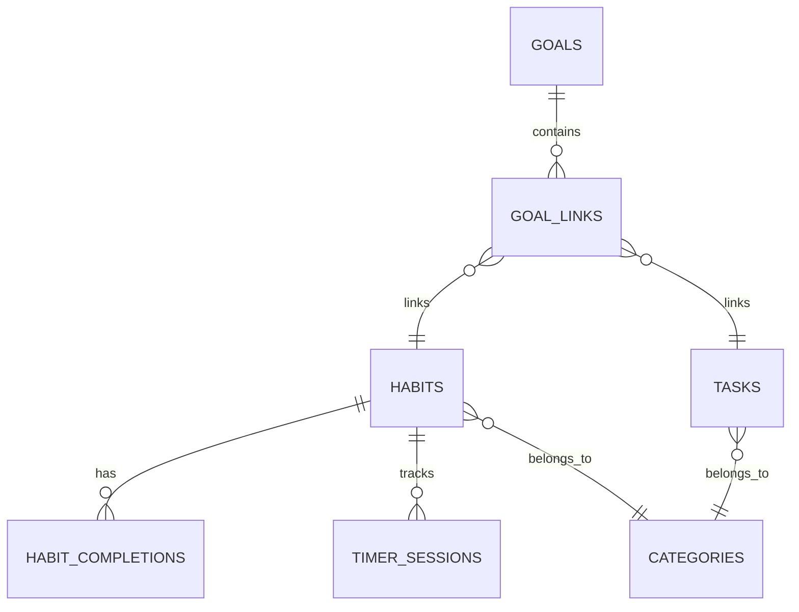
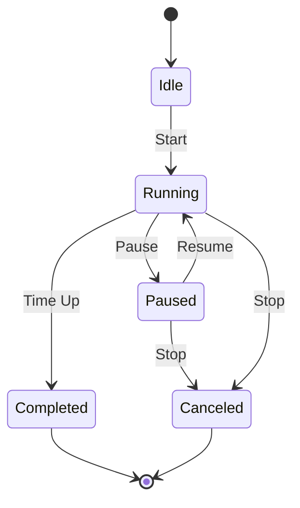
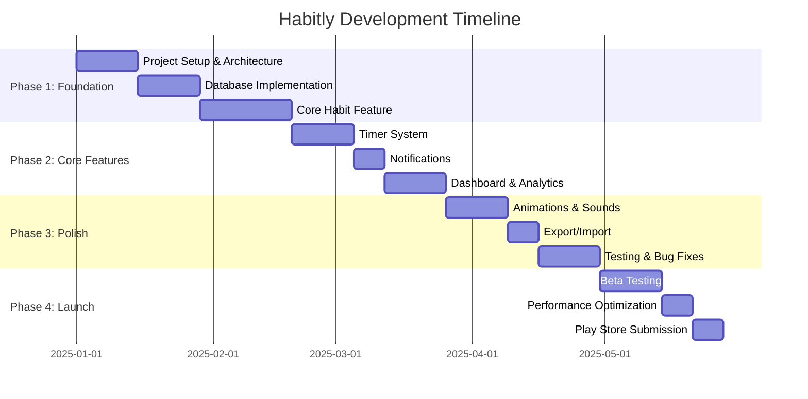

# Habitly - Complete App Specification

> **Version:** 1.0  
> **Date:** December 28, 2024  
> **Platform:** Android (Flutter)

---

## 📱 App Overview

### What is Habitly?
Habitly is a **modern, offline-first Android habit tracking and daily life optimization app** designed to help users build consistent routines, track their progress, and extract maximum potential from their daily lives.

### Why Habitly Exists
Most people struggle with consistency. They start habits but fail to maintain them due to lack of tracking, motivation, or visual progress. Habitly solves this by providing:
- **Frictionless habit tracking** with one-tap check/uncheck
- **Visual progress** through streaks, heatmaps, and analytics
- **Activity timers** for focused work sessions
- **Gentle motivation** through sounds, haptics, and micro-animations
- **Complete privacy** with 100% offline-first architecture

### Problem Statement
| Problem | Habitly's Solution |
|---------|-------------------|
| Habit apps require accounts/cloud | 100% offline, no signup needed |
| Complex interfaces overwhelm users | Minimal, calm, focused design |
| Generic tracking lacks insight | Smart dashboard with weekly/monthly analytics |
| No motivation for consistency | Streaks, sounds, haptics, celebrations |
| Timers are separate apps | Built-in activity timers (reading, exercise, focus) |

### Competitive Advantage vs Existing Apps

| Feature | Habitica | Streaks | Loop | TickTick | **Habitly** |
|---------|----------|---------|------|----------|-------------|
| Offline-first | ❌ | ✅ | ✅ | ❌ | ✅ |
| No account required | ❌ | ✅ | ✅ | ❌ | ✅ |
| Built-in timers | ❌ | ❌ | ❌ | ✅ | ✅ |
| Material You design | ❌ | ❌ | ❌ | ❌ | ✅ |
| Export/Import data | ❌ | ❌ | ✅ | ❌ | ✅ |
| Motivational feedback | ✅ | ❌ | ❌ | ❌ | ✅ |
| Cross-platform (Flutter) | ❌ | ❌ | ❌ | ✅ | ✅ |

---

## 🎯 Core Features

### 1. Daily Habit Creation (Check/Uncheck)

**Purpose:** Allow users to create, manage, and track daily habits with simple one-tap completion.

**User Flow:**
1. Tap "+" button on home screen
2. Enter habit name (e.g., "Drink 8 glasses of water")
3. Choose icon and color
4. Set frequency (daily, specific days, X times per week)
5. Set optional reminder time
6. Save habit

**UI/UX Behavior:**
- Large, tappable habit cards with circular checkboxes
- Satisfying animation + sound on completion
- Haptic feedback (light vibration)
- Streak counter visible on each habit card
- Swipe left to edit, swipe right to skip

**Edge Cases:**
- Retroactive completion: Allow marking habits complete for past days (within 7 days)
- Partial completion: For quantity-based habits (e.g., 3/8 glasses)
- Skip vs Miss: User can mark as "skipped" (doesn't break streak) vs "missed" (breaks streak)

---

### 2. One-Time & Recurring Tasks

**Purpose:** Track non-habit tasks alongside habits for complete daily planning.

**User Flow:**
1. Navigate to Tasks tab
2. Tap "+" to add task
3. Enter task name, optional due date, priority
4. Choose: One-time or Recurring (daily/weekly/monthly)
5. Save task

**UI/UX Behavior:**
- Tasks appear in a separate section below habits
- Priority badges (High: red, Medium: orange, Low: gray)
- Overdue tasks highlighted with warning color
- Completed tasks move to "Done" section with strikethrough

**Edge Cases:**
- Recurring task on non-existent date (e.g., Feb 30) → Move to last day of month
- Task with no due date → Appears in "Anytime" section

---

### 3. Custom Goals (Short-term & Long-term)

**Purpose:** Track larger objectives that consist of multiple habits/tasks.

**User Flow:**
1. Navigate to Goals screen
2. Create goal with title, description, target date
3. Link related habits/tasks to goal
4. Track progress based on linked items

**UI/UX Behavior:**
- Goal cards show progress percentage
- Circular progress indicator
- Milestone markers for long-term goals
- Celebration animation when goal completed

**Data Model:**
```
Goal {
  id, title, description, target_date,
  type: SHORT_TERM | LONG_TERM,
  linked_habit_ids[], linked_task_ids[],
  progress_percentage, is_completed
}
```

---

### 4. Activity-Based Timers

**Purpose:** Built-in focused timers for specific activities.

#### Timer Types:

| Timer | Default Duration | Sound at End | Icon |
|-------|-----------------|--------------|------|
| Reading | 30 min | Gentle chime | 📖 |
| Exercise | 45 min | Energetic tone | 💪 |
| Focus/Deep Work | 25 min (Pomodoro) | Bell | 🧠 |
| Custom | User-defined | User-selected | ⏱ |

**User Flow:**
1. Select timer type from Timer screen
2. Adjust duration if needed
3. Tap Start
4. Timer runs (background supported)
5. Pause/Resume as needed
6. On completion: sound + notification + log session

**UI/UX Behavior:**
- Large circular timer with animated progress ring
- Background gradient changes based on timer type
- Lock screen notification with controls
- Session logged automatically to activity history

**Timer States:**
```
IDLE → RUNNING → PAUSED → RUNNING → COMPLETED
                    ↓
                 CANCELED
```

---

### 5. Habit Streaks & Consistency Tracking

**Purpose:** Motivate users through visible streak counts and consistency metrics.

**Streak Logic:**
- Streak increments when habit completed on consecutive days
- Streak resets to 0 if habit missed (not skipped)
- "Current Streak" and "Best Streak" both tracked
- Weekly completion rate calculated

**UI Elements:**
- 🔥 Fire emoji for active streaks
- Streak count badge on habit card
- Streak milestone celebrations (7, 14, 30, 60, 90, 180, 365 days)
- Heatmap view showing completion history

---

### 6. Smart Dashboard

**Purpose:** Provide actionable insights through visual analytics.

**Metrics Displayed:**

| Metric | Visualization | Timeframe |
|--------|---------------|-----------|
| Daily completion rate | Circular progress | Today |
| Active streaks | List with fire icons | Current |
| Weekly trend | Line chart | 7 days |
| Monthly overview | Heatmap calendar | 30 days |
| Time spent per habit | Bar chart | Weekly |
| Most consistent habit | Highlight card | All time |
| Needs attention | Warning list | Current |

**Data Calculations:**
```dart
dailyCompletionRate = completedToday / totalHabitsToday * 100
weeklyTrend = [mon%, tue%, wed%, thu%, fri%, sat%, sun%]
consistencyScore = (totalCompleted / totalExpected) * 100
```

---

### 7. Categories & Tags

**Purpose:** Organize habits/tasks for better filtering and insights.

**Default Categories:**
- 🏃 Health & Fitness
- 📚 Learning & Growth
- 💼 Work & Productivity
- 🧘 Mind & Wellness
- 🏠 Home & Life
- 💰 Finance
- 🎨 Creativity
- ❤️ Relationships

**Features:**
- Color-coded category badges
- Filter habits by category
- Category-wise analytics
- Custom category creation

---

### 8. Gentle Reminders & Notifications

**Purpose:** Non-intrusive prompts to complete habits.

**Notification Types:**
1. **Scheduled Reminders:** At user-set time for specific habits
2. **Daily Summary:** Morning overview of today's habits
3. **Streak Warning:** "Don't break your 14-day streak!"
4. **Weekly Report:** Sunday evening summary

**Notification Settings:**
- Quiet hours (no notifications during sleep)
- Per-habit notification toggle
- Sound selection
- Vibration pattern

**Implementation:**
- Android `WorkManager` for reliable scheduling
- Exact alarms for time-sensitive reminders
- Battery optimization handling with user guidance

---

### 9. Motivational Sounds, Haptics & Micro-Animations

**Sound Design:**

| Action | Sound | Duration |
|--------|-------|----------|
| Habit complete | Soft "ding" | 0.3s |
| Streak milestone | Celebration jingle | 1.5s |
| Timer complete | Gentle bell | 2s |
| Goal achieved | Triumphant fanfare | 2s |
| Undo action | Soft "whoosh" | 0.2s |

**Haptic Patterns:**
- Light tap: Single habit check
- Double tap: Streak milestone
- Soft pulse: Timer tick (optional)
- Success pattern: Goal completion

**Micro-Animations:**
- Checkbox morphs into checkmark (150ms ease-out)
- Streak fire icon flickers on increment
- Progress ring animates smoothly
- Cards scale slightly on press (95% → 100%)
- Confetti burst on major achievements

---

### 10. Fully Offline-First Functionality

**Architecture:**
- All data stored locally in SQLite database
- No network calls required for any feature
- Optional export to local storage
- Import from backup file

**Benefits:**
- Works without internet
- No account/signup required
- Complete privacy
- Fast performance
- No subscription fees

---

## 🎨 UI/UX Design System

### Design Language
- **Style:** Material You (Material 3)
- **Philosophy:** Calm, minimal, motivational
- **Density:** Comfortable spacing, generous tap targets
- **Hierarchy:** Clear visual hierarchy with consistent typography

### Color System

**Light Theme:**
```
Primary: #6750A4 (Deep Purple)
Secondary: #625B71
Tertiary: #7D5260
Surface: #FFFBFE
Background: #FFFBFE
On-Primary: #FFFFFF
On-Surface: #1C1B1F
Success: #4CAF50
Warning: #FF9800
Error: #B3261E
```

**Dark Theme:**
```
Primary: #D0BCFF
Secondary: #CCC2DC
Tertiary: #EFB8C8
Surface: #1C1B1F
Background: #1C1B1F
On-Primary: #381E72
On-Surface: #E6E1E5
Success: #81C784
Warning: #FFB74D
Error: #F2B8B5
```

**Dynamic Theming:**
- Extract colors from user's wallpaper (Android 12+)
- Fallback to default purple theme on older devices
- Category-specific accent colors in detail views

### Typography

| Style | Font | Size | Weight | Use |
|-------|------|------|--------|-----|
| Display Large | Outfit | 57sp | 400 | Splash screen |
| Headline Large | Outfit | 32sp | 400 | Screen titles |
| Headline Medium | Outfit | 28sp | 400 | Section headers |
| Title Large | Inter | 22sp | 500 | Card titles |
| Title Medium | Inter | 16sp | 500 | List item titles |
| Body Large | Inter | 16sp | 400 | Main content |
| Body Medium | Inter | 14sp | 400 | Descriptions |
| Label Large | Inter | 14sp | 500 | Buttons |
| Label Small | Inter | 11sp | 500 | Badges |

### Iconography
- **Style:** Material Symbols (Rounded, Weight 400, Fill)
- **Size:** 24dp standard, 20dp compact, 48dp featured
- **Custom Icons:** Lottie animations for achievements and celebrations

### Motion & Animation Principles

| Animation | Duration | Easing | Use Case |
|-----------|----------|--------|----------|
| Quick feedback | 100ms | ease-out | Button presses |
| Standard transition | 250ms | ease-in-out | Page transitions |
| Emphasis | 400ms | ease-out | Achievement celebrations |
| Complex sequence | 600ms+ | custom | Onboarding animations |

**Animation Guidelines:**
- Never block user interaction with animations
- Provide reduced motion alternative
- Animations should feel natural, not flashy
- Loading states use skeleton screens, not spinners

---

## 📱 Screen-by-Screen Flow

### 1. Onboarding (First Launch Only)

**Screen 1: Welcome**
- Habitly logo with subtle animation
- "Build habits that stick" tagline
- "Get Started" button

**Screen 2: Quick Setup**
- "What do you want to focus on?" (multi-select categories)
- Suggested starter habits based on selection

**Screen 3: Reminder Preferences**
- "When do you usually wake up?" (time picker)
- "Allow notifications?" (permission request)

**Screen 4: Ready**
- "You're all set!" with celebration animation
- "Start Your Journey" button → Home screen

### 2. Home / Today Screen

```
┌─────────────────────────────────────┐
│ [≡] Today, Dec 28         [👤] [⚙]│
├─────────────────────────────────────┤
│ ┌─────────────────────────────────┐ │
│ │ Daily Progress          78%    │ │
│ │ ████████████░░░░  7/9 habits   │ │
│ └─────────────────────────────────┘ │
├─────────────────────────────────────┤
│ Morning Routine                     │
│ ┌─────────────────────────────────┐ │
│ │ ○ Meditate 10 min     🔥 14    │ │
│ │ ✓ Drink water         🔥 21    │ │
│ │ ✓ Exercise            🔥 7     │ │
│ └─────────────────────────────────┘ │
│                                     │
│ Learning                            │
│ ┌─────────────────────────────────┐ │
│ │ ○ Read 30 pages       🔥 5     │ │
│ │ ○ Practice Spanish    🔥 12    │ │
│ └─────────────────────────────────┘ │
├─────────────────────────────────────┤
│     [🏠]  [📋]  [➕]  [⏱]  [📊]    │
└─────────────────────────────────────┘
```

**Bottom Navigation:**
1. Home (Today)
2. Tasks
3. Add (FAB-style, centered)
4. Timers
5. Dashboard

### 3. Habit Detail Screen

**Elements:**
- Habit name and icon (editable)
- Current streak with fire animation
- Best streak record
- This week's completion (7 dots)
- Calendar heatmap (scrollable months)
- Time spent (if timer used)
- Notes section
- Edit / Archive / Delete actions

### 4. Timer Screen

```
┌─────────────────────────────────────┐
│          Focus Timer                │
│                                     │
│         ┌───────────┐               │
│         │   23:45   │               │
│         │  ────────  │              │
│         │  ◉◉◉◉◎◎   │  (6 sessions)│
│         └───────────┘               │
│                                     │
│    [ ⏸ Pause ]    [ ⏹ Stop ]       │
│                                     │
│  Session 4 of 6                     │
│  Total focused: 1h 32m today        │
└─────────────────────────────────────┘
```

### 5. Dashboard / Analytics Screen

**Sections:**
1. **Today's Summary Card**
   - Completion rate, active streaks
   
2. **Weekly Overview**
   - Day-by-day bar chart
   - Comparison to previous week
   
3. **Monthly Heatmap**
   - GitHub-style contribution graph
   - Color intensity = completion rate
   
4. **Top Performers**
   - Habits with longest streaks
   
5. **Needs Attention**
   - Habits with declining consistency

### 6. Settings Screen

**Sections:**
- **Appearance:** Theme (Light/Dark/System), Color scheme
- **Notifications:** Master toggle, Quiet hours, Sounds
- **Habits:** Default reminder time, Week starts on
- **Data:** Export, Import, Clear all data
- **About:** Version, Licenses, Privacy policy

---

## 📊 Dashboard & Analytics

### Metrics & Visualizations

| Metric | Chart Type | Description |
|--------|------------|-------------|
| Daily Completion | Radial gauge | % of today's habits done |
| Weekly Trend | Line chart | 7-day completion rate trend |
| Monthly View | Calendar heatmap | Color-coded daily completion |
| Habit Consistency | Horizontal bars | Per-habit completion rates |
| Time Investment | Pie chart | Time spent per category |
| Streak Leaders | Leaderboard list | Top 5 streaks |

### Motivational Feedback Logic

```dart
String getMotivationalMessage(double completionRate, int activeStreaks) {
  if (completionRate >= 100) return "Perfect day! You're unstoppable! 🎉";
  if (completionRate >= 80) return "Amazing progress! Keep it up! 💪";
  if (completionRate >= 50) return "You're halfway there! Finish strong! 🚀";
  if (activeStreaks > 5) return "Your streaks are on fire! Don't stop now! 🔥";
  return "Every step counts. You've got this! 🌟";
}
```

---

## 🗃 Local Data & Database Design

### Database Choice: **Drift (SQLite wrapper for Flutter)**

**Justification:**
- Type-safe SQL queries with Dart
- Reactive streams for real-time UI updates
- Migration support for schema changes
- Better than raw SQLite for maintainability
- More flexible than Hive for relational data

### Data Models

#### Habits Table
```sql
CREATE TABLE habits (
  id INTEGER PRIMARY KEY AUTOINCREMENT,
  name TEXT NOT NULL,
  description TEXT,
  icon TEXT NOT NULL DEFAULT 'check_circle',
  color INTEGER NOT NULL DEFAULT 0xFF6750A4,
  category_id INTEGER REFERENCES categories(id),
  frequency_type TEXT NOT NULL DEFAULT 'daily', -- daily, weekly, specific_days
  frequency_days TEXT, -- JSON array for specific days [1,3,5]
  target_count INTEGER DEFAULT 1,
  reminder_enabled INTEGER DEFAULT 0,
  reminder_time TEXT, -- HH:mm format
  created_at INTEGER NOT NULL,
  archived_at INTEGER,
  sort_order INTEGER DEFAULT 0
);
```

#### Habit Completions Table
```sql
CREATE TABLE habit_completions (
  id INTEGER PRIMARY KEY AUTOINCREMENT,
  habit_id INTEGER NOT NULL REFERENCES habits(id) ON DELETE CASCADE,
  completed_date TEXT NOT NULL, -- YYYY-MM-DD format
  completion_count INTEGER DEFAULT 1,
  completed_at INTEGER NOT NULL,
  notes TEXT,
  skipped INTEGER DEFAULT 0,
  UNIQUE(habit_id, completed_date)
);
```

#### Tasks Table
```sql
CREATE TABLE tasks (
  id INTEGER PRIMARY KEY AUTOINCREMENT,
  title TEXT NOT NULL,
  description TEXT,
  due_date TEXT, -- YYYY-MM-DD
  due_time TEXT, -- HH:mm
  priority INTEGER DEFAULT 0, -- 0: low, 1: medium, 2: high
  is_recurring INTEGER DEFAULT 0,
  recurrence_rule TEXT, -- RRULE format
  completed_at INTEGER,
  created_at INTEGER NOT NULL,
  category_id INTEGER REFERENCES categories(id)
);
```

#### Timer Sessions Table
```sql
CREATE TABLE timer_sessions (
  id INTEGER PRIMARY KEY AUTOINCREMENT,
  timer_type TEXT NOT NULL, -- reading, exercise, focus, custom
  linked_habit_id INTEGER REFERENCES habits(id),
  duration_seconds INTEGER NOT NULL,
  started_at INTEGER NOT NULL,
  ended_at INTEGER,
  completed INTEGER DEFAULT 0,
  notes TEXT
);
```

#### Goals Table
```sql
CREATE TABLE goals (
  id INTEGER PRIMARY KEY AUTOINCREMENT,
  title TEXT NOT NULL,
  description TEXT,
  goal_type TEXT NOT NULL, -- short_term, long_term
  target_date TEXT,
  progress_percentage REAL DEFAULT 0,
  is_completed INTEGER DEFAULT 0,
  created_at INTEGER NOT NULL,
  completed_at INTEGER
);
```

#### Goal Links Table
```sql
CREATE TABLE goal_links (
  id INTEGER PRIMARY KEY AUTOINCREMENT,
  goal_id INTEGER NOT NULL REFERENCES goals(id) ON DELETE CASCADE,
  habit_id INTEGER REFERENCES habits(id),
  task_id INTEGER REFERENCES tasks(id),
  CHECK (habit_id IS NOT NULL OR task_id IS NOT NULL)
);
```

#### Categories Table
```sql
CREATE TABLE categories (
  id INTEGER PRIMARY KEY AUTOINCREMENT,
  name TEXT NOT NULL,
  icon TEXT NOT NULL,
  color INTEGER NOT NULL,
  is_default INTEGER DEFAULT 0,
  sort_order INTEGER DEFAULT 0
);
```

#### Settings Table
```sql
CREATE TABLE settings (
  key TEXT PRIMARY KEY,
  value TEXT NOT NULL
);
```

### Entity Relationship Diagram



### Data Lifecycle

| Event | Action |
|-------|--------|
| App Install | Create database, seed default categories |
| Habit Created | Insert into habits table |
| Habit Completed | Insert/update habit_completions |
| Timer Finished | Insert into timer_sessions |
| Habit Archived | Set archived_at timestamp |
| Habit Deleted | Cascade delete completions, sessions |
| Data Export | Serialize all tables to JSON |
| App Uninstall | Data persists if not cleared by user |

---

## 📦 Export / Import System

### Export Flow

1. User navigates to Settings → Data → Export
2. User taps "Export All Data"
3. App serializes all tables to JSON
4. JSON file saved to Downloads folder
5. Success toast with file path
6. Option to share file

### Export File Format

```json
{
  "app": "Habitly",
  "version": "1.0.0",
  "exported_at": "2024-12-28T14:30:00Z",
  "data": {
    "categories": [...],
    "habits": [...],
    "habit_completions": [...],
    "tasks": [...],
    "timer_sessions": [...],
    "goals": [...],
    "goal_links": [...],
    "settings": {...}
  },
  "checksum": "sha256:abc123..."
}
```

### Import Flow

1. User navigates to Settings → Data → Import
2. User selects JSON file from storage
3. App validates file structure and checksum
4. Confirmation dialog: "This will replace all existing data"
5. On confirm: Clear database, insert imported data
6. Success/Error feedback

### Data Integrity Checks

```dart
bool validateBackup(Map<String, dynamic> backup) {
  // 1. Verify app identifier
  if (backup['app'] != 'Habitly') return false;
  
  // 2. Verify checksum
  final data = jsonEncode(backup['data']);
  final expectedChecksum = backup['checksum'];
  final actualChecksum = 'sha256:${sha256.convert(utf8.encode(data))}';
  if (expectedChecksum != actualChecksum) return false;
  
  // 3. Verify required tables exist
  final requiredTables = ['habits', 'categories', 'settings'];
  for (final table in requiredTables) {
    if (!backup['data'].containsKey(table)) return false;
  }
  
  return true;
}
```

---

## ⚙️ Tech Stack

### Frontend

| Technology | Purpose | Justification |
|------------|---------|---------------|
| **Flutter 3.x** | UI Framework | Cross-platform, excellent performance, rich widget library |
| **Material 3** | Design System | Native Android look, dynamic theming support |
| **Riverpod** | State Management | Type-safe, testable, better than Provider for complex state |
| **go_router** | Navigation | Declarative routing, deep linking support |
| **Lottie** | Animations | Lightweight, designer-friendly, smooth 60fps |
| **just_audio** | Sound Effects | Low latency, background playback |
| **vibration** | Haptics | Native haptic feedback patterns |

### Database

| Technology | Purpose | Justification |
|------------|---------|---------------|
| **Drift** | SQLite ORM | Type-safe, reactive, migration support |
| **path_provider** | File Access | Platform-agnostic file storage |

### Background Processing

| Technology | Purpose | Justification |
|------------|---------|---------------|
| **flutter_local_notifications** | Notifications | Full-featured, reliable |
| **android_alarm_manager_plus** | Exact Alarms | Precise scheduling for reminders |
| **workmanager** | Background Tasks | Battery-efficient, guaranteed execution |

### Project Structure

```
lib/
├── main.dart
├── app.dart
├── core/
│   ├── constants/
│   ├── extensions/
│   ├── theme/
│   └── utils/
├── data/
│   ├── database/
│   │   ├── database.dart
│   │   ├── tables/
│   │   └── daos/
│   ├── models/
│   └── repositories/
├── domain/
│   ├── entities/
│   └── usecases/
├── presentation/
│   ├── providers/
│   ├── screens/
│   │   ├── home/
│   │   ├── habits/
│   │   ├── tasks/
│   │   ├── timers/
│   │   ├── dashboard/
│   │   ├── settings/
│   │   └── onboarding/
│   └── widgets/
├── services/
│   ├── notification_service.dart
│   ├── sound_service.dart
│   └── export_service.dart
└── l10n/
```

---

## 🚀 Build & Deployment Pipeline

### CI/CD with Codemagic

**Purpose:** Automate building, testing, and deploying Android APKs.

### codemagic.yaml Structure

```yaml
workflows:
  android-workflow:
    name: Android Production Build
    instance_type: mac_mini_m1
    max_build_duration: 60
    
    environment:
      android_signing:
        - habitly_keystore
      groups:
        - google_credentials
      flutter: stable
      java: 21
    
    triggering:
      events:
        - push
      branch_patterns:
        - pattern: main
          include: true
    
    scripts:
      - name: Set up local.properties
        script: echo "flutter.sdk=$HOME/programs/flutter" > "$CM_BUILD_DIR/android/local.properties"
      
      - name: Get Flutter packages
        script: flutter packages pub get
      
      - name: Run tests
        script: flutter test
      
      - name: Build APK
        script: |
          flutter build apk --release \
            --build-name=1.0.0 \
            --build-number=$BUILD_NUMBER
      
      - name: Build App Bundle
        script: |
          flutter build appbundle --release \
            --build-name=1.0.0 \
            --build-number=$BUILD_NUMBER
    
    artifacts:
      - build/**/outputs/**/*.apk
      - build/**/outputs/**/*.aab
      - build/**/outputs/**/mapping.txt
    
    publishing:
      email:
        recipients:
          - team@habitly.app
        notify:
          success: true
          failure: true
```

### Build Flavors

| Flavor | Package Name | Features |
|--------|--------------|----------|
| Debug | com.habitly.app.debug | Debug logs, dev tools |
| Release | com.habitly.app | Optimized, signed |

### App Signing

```yaml
# In Codemagic environment variables
CM_KEYSTORE: base64-encoded keystore
CM_KEYSTORE_PASSWORD: ******
CM_KEY_ALIAS: habitly
CM_KEY_PASSWORD: ******
```

---

## 🔔 Timer & Background Tasks

### Timer States



### Background Execution Strategy

1. **Foreground Service:** Timer runs as Android foreground service
2. **Persistent Notification:** Shows remaining time with pause/stop controls
3. **WakeLock:** Prevents CPU sleep during active timer
4. **State Persistence:** Save timer state to database on every state change
5. **Resume on Kill:** If app killed, restore timer state on reopen

### Battery Optimization Handling

```dart
Future<void> requestBatteryOptimizationExemption() async {
  final isIgnoring = await Permission.ignoreBatteryOptimizations.isGranted;
  
  if (!isIgnoring) {
    // Show explanation dialog
    final shouldRequest = await showDialog<bool>(...);
    
    if (shouldRequest == true) {
      await Permission.ignoreBatteryOptimizations.request();
    }
  }
}
```

---

## 🧪 Testing Strategy

### Unit Tests

| Component | Test Coverage |
|-----------|---------------|
| Streak Calculator | All edge cases (skip, miss, retroactive) |
| Timer Logic | State transitions, pause/resume |
| Data Repositories | CRUD operations, error handling |
| Export/Import | Serialization, validation, integrity |
| Date Utils | Week boundaries, timezone handling |

### Widget/UI Tests

| Screen | Test Cases |
|--------|------------|
| Home | Habit list renders, check/uncheck works |
| Timer | Start/pause/stop, time display updates |
| Dashboard | Charts render with data |
| Settings | Toggle states persist |

### Integration Tests

```dart
testWidgets('Complete habit flow', (tester) async {
  await tester.pumpWidget(HabitlyApp());
  
  // Create habit
  await tester.tap(find.byIcon(Icons.add));
  await tester.pumpAndSettle();
  await tester.enterText(find.byType(TextField), 'Test Habit');
  await tester.tap(find.text('Save'));
  await tester.pumpAndSettle();
  
  // Complete habit
  await tester.tap(find.byType(HabitCheckbox));
  await tester.pumpAndSettle();
  
  // Verify streak increased
  expect(find.text('🔥 1'), findsOneWidget);
});
```

### Timer Accuracy Testing

```dart
test('Timer accuracy within 100ms tolerance', () async {
  final timer = PomodoroTimer(duration: Duration(seconds: 5));
  final stopwatch = Stopwatch()..start();
  
  timer.start();
  await timer.onComplete;
  stopwatch.stop();
  
  expect(stopwatch.elapsedMilliseconds, closeTo(5000, 100));
});
```

---

## 🧩 Optional Future Features

### Phase 2+ Roadmap

| Feature | Description | Priority |
|---------|-------------|----------|
| **Home Screen Widgets** | Quick habit check from launcher | High |
| **Badges & Achievements** | Gamification with unlockable milestones | Medium |
| **Cloud Sync** | Optional Google Drive backup | Medium |
| **Habit Templates** | Pre-built habit packs (Morning Routine, etc.) | Medium |
| **Social Sharing** | Share streaks to social media | Low |
| **AI Suggestions** | Personalized habit recommendations | Low |
| **Wear OS Support** | Complete habits from smartwatch | Low |

---

## 📅 MVP & Roadmap

### MVP Feature List (v1.0)

- [x] Habit creation with customization
- [x] Daily habit check/uncheck
- [x] Streak tracking
- [x] Basic timer (focus mode)
- [x] Local notifications
- [x] Light/dark theme
- [x] Settings screen
- [x] Data export/import

### Development Roadmap



### Timeline Summary

| Phase | Duration | Deliverables |
|-------|----------|--------------|
| **Phase 1** | Weeks 1-7 | Core architecture, database, basic habits |
| **Phase 2** | Weeks 8-12 | Timers, notifications, analytics |
| **Phase 3** | Weeks 13-17 | Polish, animations, export/import |
| **Phase 4** | Weeks 18-21 | Testing, optimization, launch |

**Total Estimated Timeline:** 5-6 months for v1.0 release

---

## 📋 Accessibility Considerations

| Requirement | Implementation |
|-------------|----------------|
| Screen Reader | Semantic labels on all interactive elements |
| Font Scaling | Support up to 200% system font size |
| Color Contrast | WCAG AA compliant (4.5:1 minimum) |
| Touch Targets | Minimum 48dp for all interactive elements |
| Reduced Motion | Honor system animation settings |
| Haptic Alternatives | Visual feedback when haptics disabled |

---

## 🔐 Privacy & Security

- **No Analytics:** No third-party analytics or tracking
- **No Network:** App works 100% offline
- **Local Storage:** All data on device only
- **No Accounts:** No signup, login, or personal info collection
- **Export Control:** User controls all data export
- **Secure Backup:** Exported files can be encrypted (future)

---

> **Document Status:** Ready for Development  
> **Last Updated:** December 28, 2024  
> **Author:** Habitly Product Team

---

*This specification provides everything needed to begin development. Start with Phase 1 foundation work and iterate based on user feedback during beta testing.*
